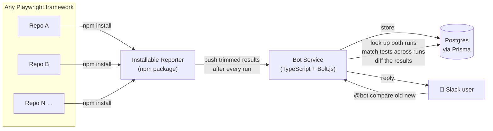

# fail-forward-slack-bot

**Ask Slack what broke. Get an answer that actually makes sense.**

A universal, pluggable Slack bot for comparing CI test-failure results between two Playwright
runs — built to drop into *any* Playwright (JS/TS) framework, not tied to one project. No more
scrolling through two giant CI logs side by side trying to spot what's actually new.

```
@YourBot compare <old-run> <new-run>
```

...and get back three things that actually matter:

- 🔴 **New failures** — tests that weren't broken last time
- 🟠 **Same test, different reason** — still failing, but the *why* changed
- 🟢 **Newly passing** — tests that were broken and now aren't

---

## Why this exists

Most CI failure noise isn't new information — it's the same 40 flaky tests you already know
about. The actual signal is: *what changed since the last run?* This bot answers exactly that,
on demand.

## How it works



1. **Every run pushes its results.** The Reporter runs inside your test framework and silently
   sends a trimmed results payload to the bot after each run — no CI scripting needed on your end.
2. **You ask, it answers.** Nothing happens until someone types `@bot compare old new` in Slack —
   the bot looks up both runs, matches tests between them, and replies.

## Matching tests across two runs

A test's identity isn't always stable — renames happen. Matching runs in two phases:

1. **Exact match** (file path + test title) — handles the vast majority, fast.
2. **Same-file rename detection** — for whatever's left unmatched on each side (a small set), a
   title-similarity check within the same file catches renames instead of reporting a false
   "new + removed" pair. Cross-file moves aren't handled yet (v1 limitation, by design).

## Installation

```bash
npm install fail-forward-reporter
```

Add it to your `playwright.config.ts`:

```ts
reporter: [
  ["fail-forward-reporter", {
    endpoint: "https://your-bot-service-url",
    project: "your-repo-name",
  }],
],
```

That's it — every run now pushes its results automatically. In Slack:

```
@YourBot compare <old-run> <new-run>
```

## Tech stack

| Piece | Choice | Why |
|---|---|---|
| Language | TypeScript | Type-safe, matches the ecosystem it plugs into |
| Database | Postgres via Prisma | Open source (Apache 2.0), free; relational shape fits runs/tests naturally |
| Hosting (DB) | Supabase (free tier) | Zero-cost hosted Postgres |
| Slack integration | Bolt.js (`@slack/bolt`) | Official SDK — listens + replies, no separate hosted workflow tool needed |
| Distribution | npm package (Playwright Reporter) | Drop-in install for any consuming framework |

## Project structure

```
src/            # the comparison engine — types, matching, diffing, parsing, formatting
prisma/         # database schema (Postgres via Prisma)
```

## License

TBD.
