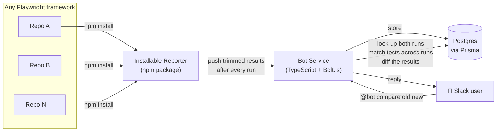

# fail-forward-slack-bot

**Ask Slack what broke. Get an answer that actually makes sense.**

A universal, pluggable Slack bot for comparing CI test-failure results between two Playwright
runs — built to drop into *any* Playwright (JS/TS) framework, not tied to one project. No more
scrolling through two giant CI logs side by side trying to spot what's actually new.

```
@YourBot compare <old-run> <new-run>
```

...and get back three things that actually matter:

- 🔴 **New failures** — tests that weren't broken last time
- 🟠 **Same test, different reason** — still failing, but the *why* changed
- 🟢 **Newly passing** — tests that were broken and now aren't

---

## Why this exists

Most CI failure noise isn't new information — it's the same 40 flaky tests you already know
about. The actual signal is: *what changed since the last run?* This bot answers exactly that,
on demand.

## How it works


```mermaid
flowchart LR
    subgraph Frameworks["Any Playwright framework"]
        R1[Repo A]
        R2[Repo B]
        R3[Repo N …]
    end

    RP["Installable Reporter\n(npm package)"]

    R1 -- "npm install" --> RP
    R2 -- "npm install" --> RP
    R3 -- "npm install" --> RP

    RP -- "push trimmed results\nafter every run" --> SVC["Bot Service\n(TypeScript + Bolt.js)"]
    SVC -- "store" --> DB[("Postgres\nvia Prisma")]

    User["🧑 Slack user"] -- "@bot compare old new" --> SVC
    SVC -- "look up both runs\nmatch tests across runs\ndiff the results" --> DB
    SVC -- "reply" --> User
```

1. **Every run pushes its results.** The Reporter runs inside your test framework and silently
   sends a trimmed results payload to the bot after each run — no CI scripting needed on your end.
2. **You ask, it answers.** Nothing happens until someone types `@bot compare old new` in Slack —
   the bot looks up both runs, matches tests between them, and replies.

## Matching tests across two runs

A test's identity isn't always stable — renames happen. Matching runs in two phases:

1. **Exact match** (file path + test title) — handles the vast majority, fast.
2. **Same-file rename detection** — for whatever's left unmatched on each side (a small set), a
   title-similarity check within the same file catches renames instead of reporting a false
   "new + removed" pair. Cross-file moves aren't handled yet (v1 limitation, by design).

## Installation

The Reporter isn't published as a standalone npm package yet, so integrating it today takes two
real steps (a genuine `npm install fail-forward-reporter` is the eventual goal, not yet built):

**1. Get the bot service running somewhere reachable.** `src/server.ts` (the `/runs` endpoint) and
`src/slack.ts` (the Slack bot) both need to actually be running — on your own machine for local
testing, or deployed somewhere your CI can reach over the network for real use. Nothing works
until this service is up and its URL is reachable from wherever your Playwright tests run.

**2. Get `reporter.ts` into your project.** Since it's not on npm yet, either clone this repo
somewhere accessible to your project and reference it by that real file path, or copy
`src/reporter.ts` directly into your own codebase. Either way, wire it into your
`playwright.config.ts`, pointing `endpoint` at wherever step 1's service is actually running:

```ts
reporter: [
  ["path/to/reporter.ts", {
    endpoint: "https://your-deployed-bot-service-url/runs",
    project: "your-repo-name",
  }],
],
```

`demo-tests/` and `playwright.config.ts` in THIS repo are a working example of exactly this
wiring (Reporter + a locally-running server), verified end-to-end against a real Postgres
database — a good reference for confirming your own setup matches.

That's it — every run now pushes its results automatically. In Slack:

```
@YourBot compare <old-run> <new-run>
```

## Tech stack

| Piece | Choice | Why |
|---|---|---|
| Language | TypeScript | Type-safe, matches the ecosystem it plugs into |
| Database | Postgres via Prisma | Open source (Apache 2.0), free; relational shape fits runs/tests naturally |
| Hosting (DB) | Supabase (free tier) | Zero-cost hosted Postgres |
| Slack integration | Bolt.js (`@slack/bolt`) | Official SDK — listens + replies, no separate hosted workflow tool needed |
| Ingestion server | Express | Receives a Reporter's POST and writes it to Postgres |
| Distribution | Playwright Reporter class (`src/reporter.ts`) | Drop-in install for any consuming framework — not yet published to npm |

## Project structure

```
src/
  types.ts        # shapes: Run, TestResult, DiffResult
  fingerprint.ts  # unique key per test (file + title)
  diff.ts         # the comparison engine — new/changed/newly-passing
  rename.ts       # same-file rename detection, wired into diff.ts
  parser.ts       # parses the Slack "compare <old> <new>" command
  formatter.ts    # turns a DiffResult into the Slack reply text
  persistence.ts  # saveRun / getRunResults — Postgres reads/writes
  db.ts           # shared Prisma Client instance
  slack.ts        # the Bolt app — listens for @mentions, runs the pipeline
  server.ts       # the /runs HTTP endpoint a Reporter POSTs to
  reporter.ts     # the installable Playwright Reporter class
prisma/           # database schema (Postgres via Prisma)
demo-tests/       # a working example Playwright suite proving reporter.ts end-to-end
playwright.config.ts  # wires demo-tests/ to reporter.ts, exactly as a real project would
```

## License

TBD.
